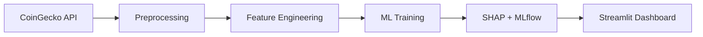

<div align="center">

# Cryptocurrency Volatility Prediction


### Predict next-day crypto volatility with production ML — XGBoost, SHAP, and a premium fintech dashboard

<br/>

[](https://crypto-volatility-prediction.streamlit.app)
[](https://github.com/RidyanshiChouhan/Crypto-Volatility-Prediction#quick-start)
[](https://github.com/RidyanshiChouhan/Crypto-Volatility-Prediction)

</div>

---

> **See the live app first** → [Open Live Demo](https://crypto-volatility-prediction.streamlit.app) | Then explore the code below.

<br/>

<p align="center">
  
</p>

<p align="center"><i>Add your demo GIF to <code>docs/assets/demo.gif</code> after recording the Streamlit app</i></p>

---

## Screenshots

| Dashboard KPIs | Volatility Forecast | Portfolio Risk |
|:---:|:---:|:---:|
|  | Feature importance & SHAP in app | PDF/CSV export |

---

## Key Features

| Feature | Description |
|---------|-------------|
| **10,000+ records** | 7 cryptocurrencies with OHLCV + market cap |
| **15+ indicators** | RSI, MACD, Bollinger, ATR, rolling volatility, and more |
| **4 ML models** | Linear Regression, Random Forest, XGBoost, LightGBM |
| **Hyperparameter tuning** | RandomizedSearchCV + TimeSeriesSplit |
| **SHAP explainability** | Global & local feature impact |
| **Real-time data** | CoinGecko API with auto-refresh |
| **Portfolio risk** | Multi-asset exposure & volatility estimate |
| **MLOps** | MLflow tracking, Docker, GitHub Actions CI (80%+ coverage) |

---

## Architecture



Full documentation: [HLD](docs/HLD.md) | [LLD](docs/LLD.md) | [Pipeline](docs/PIPELINE.md)

---

## Results

| Model | RMSE | MAE | R² |
|-------|------|-----|-----|
| **XGBoost** | **0.00466** | 0.00386 | **0.798** |
| Random Forest | 0.00470 | 0.00354 | 0.794 |
| LightGBM | 0.00501 | 0.00424 | 0.766 |
| Linear Regression (baseline) | 0.00578 | 0.00502 | 0.689 |

*Trained on 10,500+ records (7 cryptos × 1,500 days). Run `python scripts/bootstrap.py` to reproduce.*

**Highlights:**
- ~19% RMSE improvement over linear baseline
- Leakage-safe target: `Volatility(t+1)`
- Chronological train/test split

---

## Quick Start

See **[SETUP.md](SETUP.md)** for the fastest path (minimal install + offline bootstrap).

```bash
git clone https://github.com/RidyanshiChouhan/Crypto-Volatility-Prediction.git
cd Crypto-Volatility-Prediction
python -m venv .venv
.\.venv\Scripts\activate          # Windows
pip install -r requirements-minimal.txt

# Offline: 10,500 rows + trained model (~2 min)
python scripts/bootstrap.py

streamlit run app/streamlit_app.py
```

Open **http://localhost:8501**

---

## Project Structure

```
Crypto-Volatility-Prediction/
├── app/                    # Streamlit dashboard
├── data/raw|processed/     # Datasets
├── docs/                   # HLD, LLD, deployment guides
├── models/                 # best_model.pkl
├── notebooks/              # EDA, features, modeling
├── reports/                # Metrics, SHAP, plots
├── scripts/                # Pipeline & EDA scripts
├── src/                    # Core Python modules
├── tests/                  # pytest suite (80%+ coverage)
├── Dockerfile
├── docker-compose.yml
└── requirements.txt
```

---

## Tech Stack

Python · Pandas · NumPy · scikit-learn · XGBoost · LightGBM · pandas-ta · MLflow · SHAP · Plotly · Streamlit · Docker · GitHub Actions

---

## Deployment

| Platform | Guide |
|----------|-------|
| Streamlit Cloud | [docs/DEPLOYMENT.md](docs/DEPLOYMENT.md#1-streamlit-community-cloud) |
| Render | [docs/DEPLOYMENT.md](docs/DEPLOYMENT.md#2-render) |
| Railway | [docs/DEPLOYMENT.md](docs/DEPLOYMENT.md#3-railway) |
| Docker | `docker compose up --build` |

---

## Testing

```bash
pytest tests/ --cov=src --cov=app --cov-fail-under=80
```

---

## Documentation

- [High-Level Design](docs/HLD.md)
- [Low-Level Design](docs/LLD.md)
- [ML Pipeline](docs/PIPELINE.md)
- [GitHub Setup](docs/GITHUB_SETUP.md)
- [Portfolio Copy (Resume/LinkedIn)](docs/PORTFOLIO_COPY.md)

---

## Resume Alignment

This project demonstrates:

- Built volatility prediction model on **10,000+ records**
- Engineered **15+ technical indicators**
- Improved forecasting performance over **baseline models**
- Evaluated using **RMSE, MAE, and R²**
- Developed interactive **Streamlit dashboard**
- **Deployed publicly** with Docker & CI/CD

---

## License

MIT License — see [LICENSE](LICENSE)

---

<div align="center">

**If this project helped you, consider starring the repo**

[](https://github.com/RidyanshiChouhan/Crypto-Volatility-Prediction)

</div>

---

## Code & Development

<details>
<summary><b>Click to expand developer documentation</b></summary>

### Data Pipeline

```bash
python scripts/train_pipeline.py      # Full ML pipeline
python scripts/generate_eda_plots.py  # Export EDA charts
python scripts/create_notebooks.py    # Generate Jupyter notebooks
```

### Modules

| Module | Purpose |
|--------|---------|
| `src/data_loader.py` | CoinGecko API + synthetic fallback |
| `src/preprocessing.py` | Cleaning, outliers, scaling |
| `src/feature_engineering.py` | Indicators + target |
| `src/training.py` | Models + tuning + MLflow |
| `src/evaluation.py` | RMSE, MAE, R² |
| `src/predict.py` | Inference + risk levels |
| `src/explainability.py` | SHAP reports |

### Contributing

1. Fork the repository
2. Create a feature branch
3. Run tests: `pytest`
4. Submit a pull request

</details>
