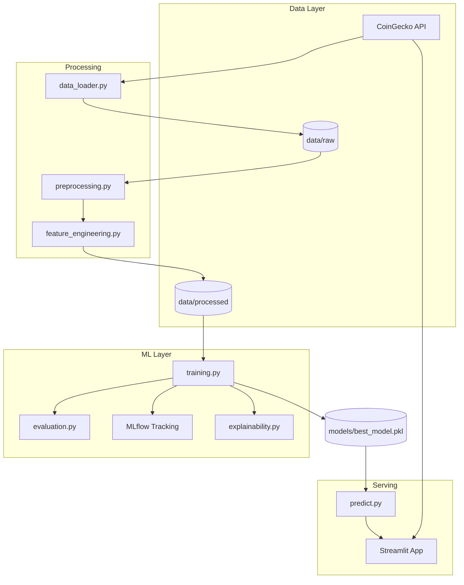

# High-Level Design (HLD)

## Cryptocurrency Volatility Prediction System

### 1. Overview

End-to-end ML system that forecasts **next-day cryptocurrency volatility** using historical OHLCV data, technical indicators, and ensemble gradient boosting models. Delivered via an interactive Streamlit dashboard with real-time CoinGecko integration.

### 2. Architecture Diagram

### 3. System Components

| Component | Responsibility |
|-----------|----------------|
| **Data Loader** | Fetch OHLCV from CoinGecko, persist CSV, synthetic fallback |
| **Preprocessing** | Missing values, duplicates, outliers, scaling |
| **Feature Engineering** | 15+ technical indicators, target `Volatility(t+1)` |
| **Training** | LR, RF, XGBoost, LightGBM; TimeSeriesSplit tuning |
| **Evaluation** | RMSE, MAE, R² comparison |
| **Explainability** | SHAP global/local plots |
| **Streamlit App** | KPIs, charts, portfolio risk, exports |

### 4. Technology Stack

| Layer | Technologies |
|-------|--------------|
| Language | Python 3.12+ |
| Data | Pandas, NumPy |
| Viz | Plotly, Matplotlib, Seaborn |
| ML | scikit-learn, XGBoost, LightGBM |
| Indicators | pandas-ta |
| Tracking | MLflow |
| XAI | SHAP |
| UI | Streamlit |
| Deploy | Docker, Streamlit Cloud, Render, Railway |
| CI | GitHub Actions |

### 5. Non-Functional Requirements

- **Reproducibility**: Fixed random seeds, version-pinned dependencies
- **Time-series integrity**: Chronological splits, no shuffle, shifted targets
- **Observability**: MLflow metrics, JSON reports, SHAP artifacts
- **Availability**: Synthetic data fallback when API unavailable

### 6. Security

- No secrets in repository
- Rate-limited API calls
- `.env` excluded via `.gitignore`
