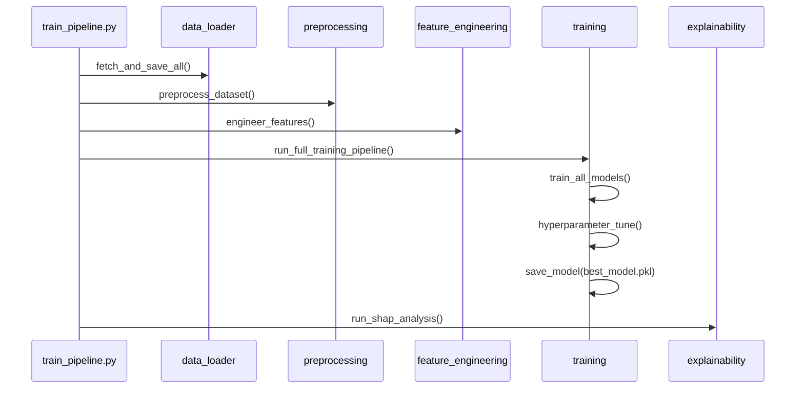
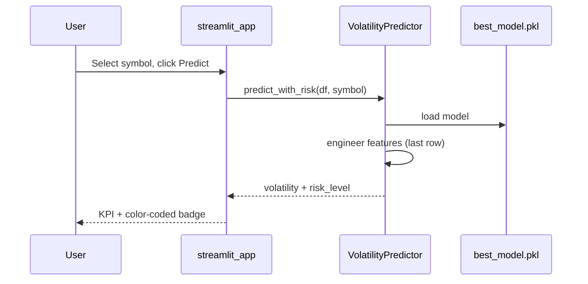

# Low-Level Design (LLD)

## Module Design

### Class: `PreprocessingPipeline`

| Method | Description |
|--------|-------------|
| `fix_dtypes()` | Cast date, symbol, numeric columns |
| `remove_duplicates()` | Drop duplicate symbol-date rows |
| `handle_missing_values()` | Group-wise ffill/bfill |
| `clip_outliers()` | IQR-based clipping per symbol |
| `fit()` / `transform()` | StandardScaler or RobustScaler |

### Class: `VolatilityPredictor`

| Method | Description |
|--------|-------------|
| `load()` | Load `best_model.pkl` + metadata |
| `prepare_features()` | Run indicators for symbol |
| `predict()` | Next-row volatility forecast |
| `classify_risk()` | Low / Medium / High mapping |

### Function Flow: Training



### Function Flow: Inference



### Target Definition

```
daily_return(t) = (close(t) - close(t-1)) / close(t-1)
current_volatility(t) = rolling_std(daily_return, window=7)
target_volatility_next(t) = current_volatility(t+1)  # shift -1 per symbol
```

Features at time `t` use only information available through `t` (no future leakage).

### Model Registry

```python
{
  "linear_regression": LinearRegression(),
  "random_forest": RandomForestRegressor(...),
  "xgboost": XGBRegressor(...),
  "lightgbm": LGBMRegressor(...),
}
```

Selection criterion: **lowest RMSE** on chronological test set.

### File Dependencies

```
app/streamlit_app.py
  → src/predict.py
  → src/data_loader.py
  → src/config.py

scripts/train_pipeline.py
  → src/* (full pipeline)
```
