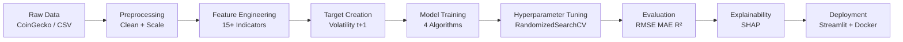

# ML Pipeline Architecture

## End-to-End Pipeline



## Stage Details

### 1. Raw Data
- Sources: CoinGecko API (`/ohlc`, `/market_chart`)
- Symbols: BTC, ETH, BNB, SOL, ADA, XRP, DOGE
- Columns: date, symbol, open, high, low, close, volume, market_cap

### 2. Preprocessing
- Duplicate removal on (symbol, date)
- Forward-fill missing values within symbol
- IQR outlier clipping (3× IQR)
- Optional RobustScaler / StandardScaler on features

### 3. Feature Engineering
- Returns, rolling volatility, SMA/EMA, RSI, MACD, Bollinger, ATR
- Momentum, ROC, liquidity ratio, volatility index
- 20+ numeric features for modeling

### 4. Training
- Time-series train/test split (80/20 chronological)
- Models: Linear Regression, Random Forest, XGBoost, LightGBM
- MLflow experiment logging
- Best model saved to `models/best_model.pkl`

### 5. Tuning
- `RandomizedSearchCV` + `TimeSeriesSplit(n_splits=5)`
- Parameters: n_estimators, max_depth, learning_rate, subsample

### 6. Evaluation
- Metrics: RMSE, MAE, R²
- Comparison table: `reports/model_comparison.csv`

### 7. Deployment
- Streamlit dashboard with real-time refresh
- Docker container on port 8501

## Run Commands

```bash
# Full pipeline
python scripts/train_pipeline.py

# EDA plots
python scripts/generate_eda_plots.py

# Dashboard
streamlit run app/streamlit_app.py
```
